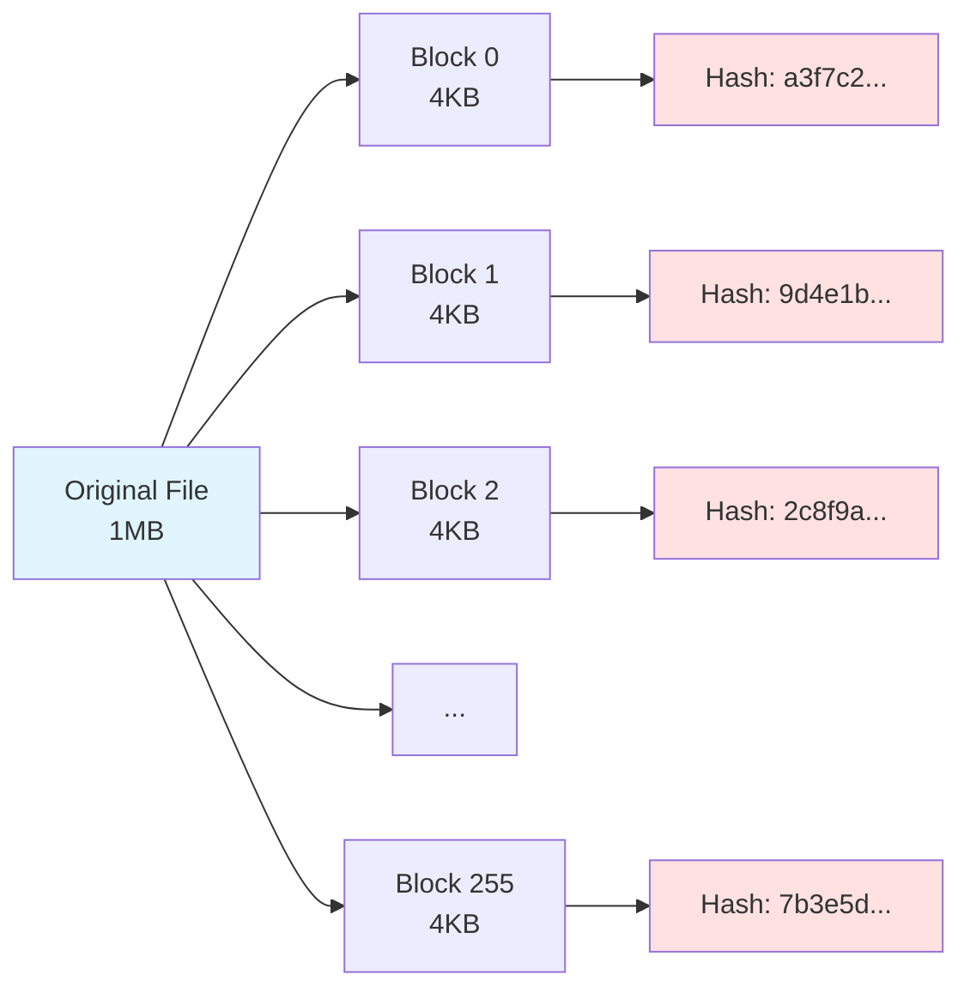
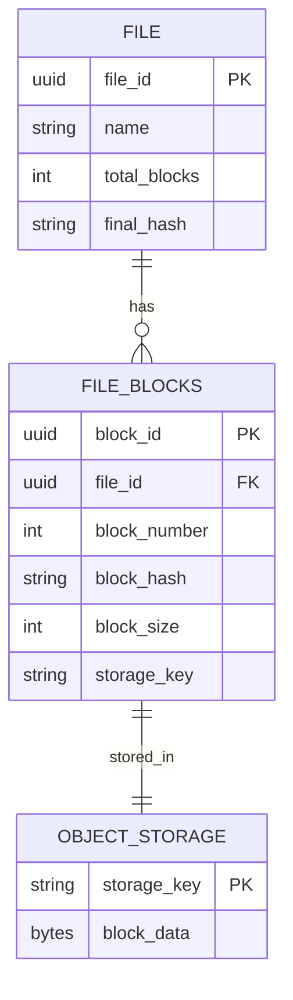
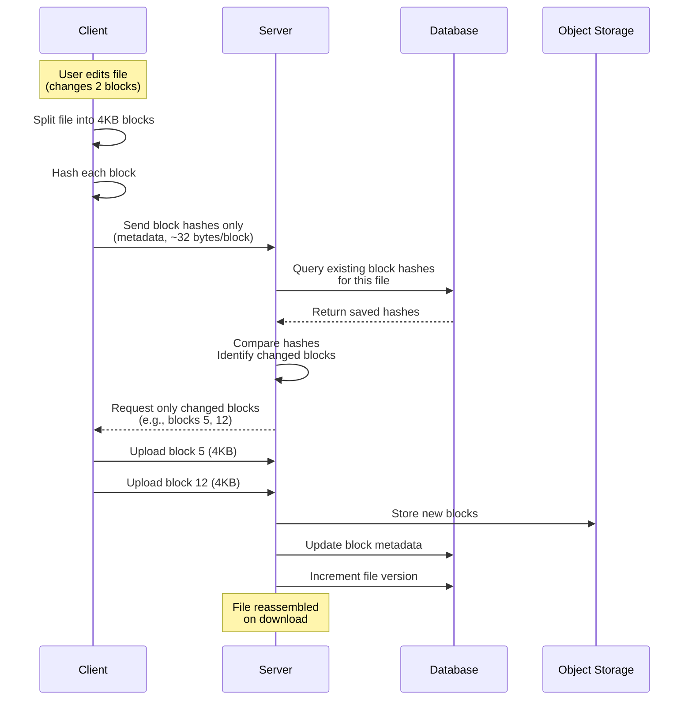
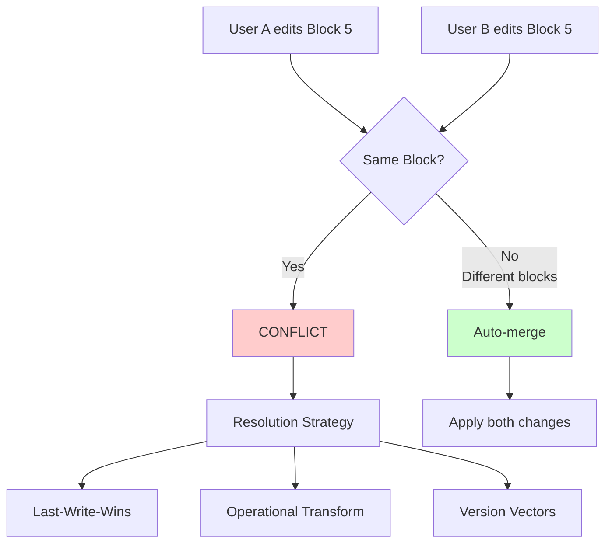
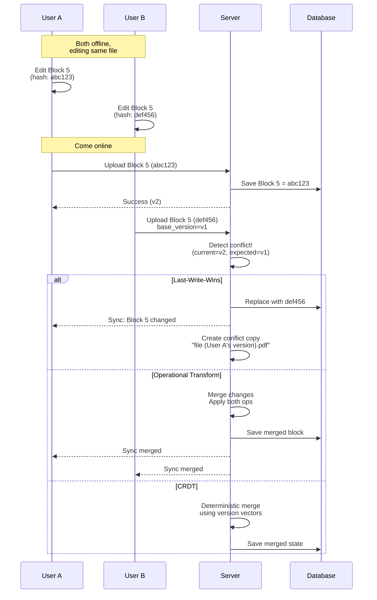
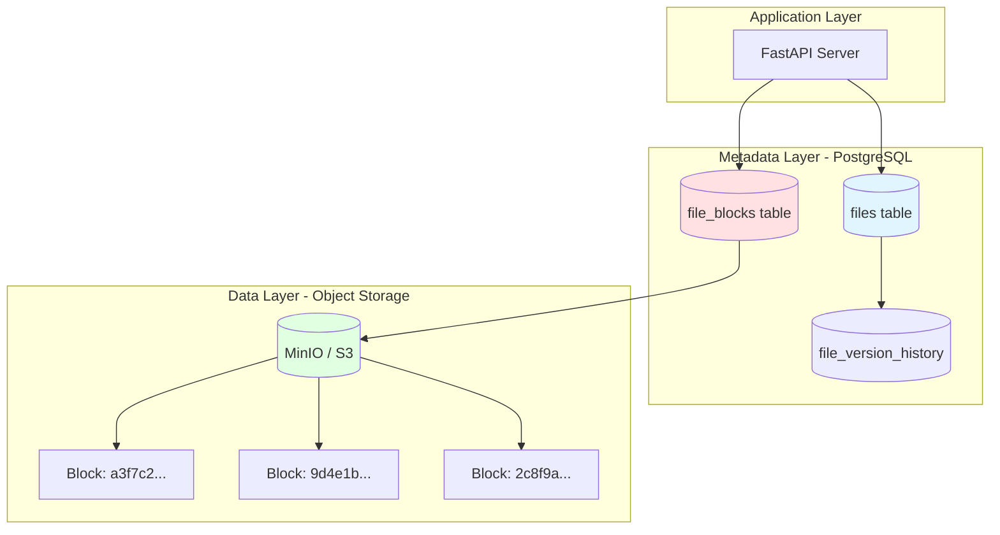
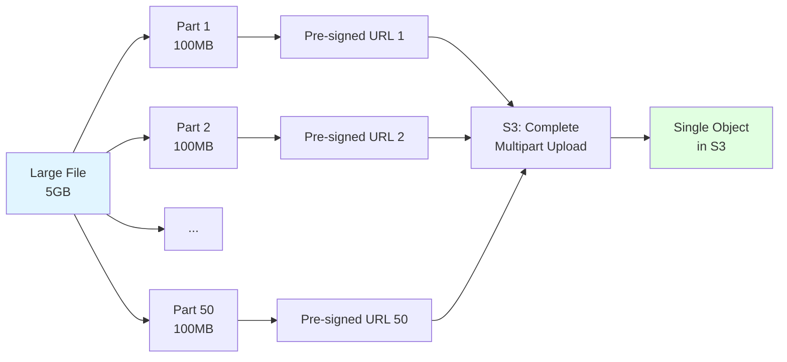
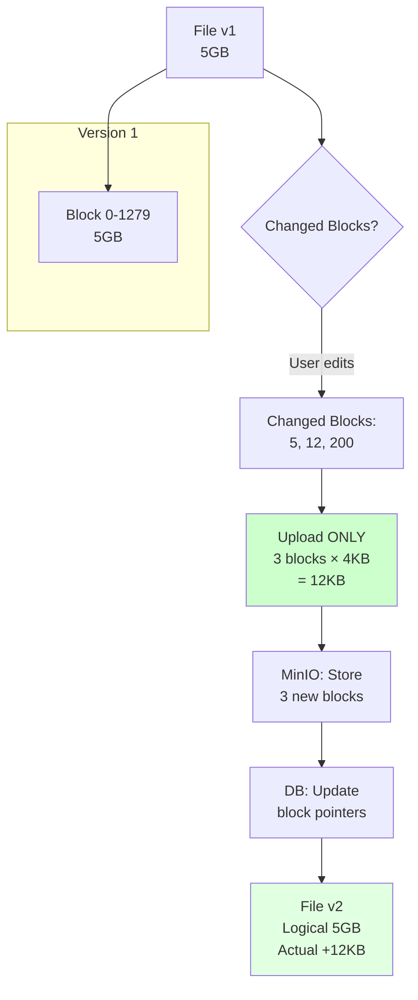
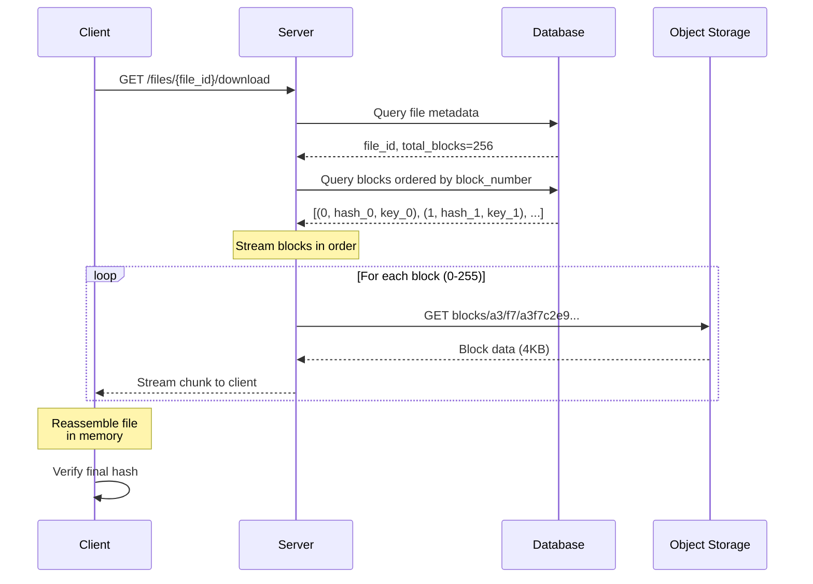
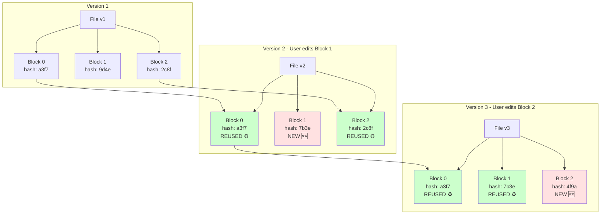

# Block-Level Differential Synchronization

> **Interview-Ready Guide**: Production concepts for Google Drive, Dropbox-style block servers

---

## 📚 Table of Contents
1. [What is Block-Level Differential Sync?](#what-is-block-level-differential-sync)
2. [Block Splitting & Hashing](#block-splitting--hashing)
3. [Patching Mechanism (Rsync Algorithm)](#patching-mechanism-rsync-algorithm)
4. [Conflict Resolution](#conflict-resolution)
5. [Storage Architecture](#storage-architecture)
6. [Multipart Upload vs Block Upload](#multipart-upload-vs-block-upload)
7. [File Reassembly](#file-reassembly)
8. [Version History with Blocks](#version-history-with-blocks)
9. [Production Implementation](#production-implementation)
10. [Interview Cheat Sheet](#interview-cheat-sheet)

---

## What is Block-Level Differential Sync?

**Definition**: Instead of uploading entire files on every change, divide files into fixed-size blocks (4KB) and only upload changed blocks.

### When Used
- **Google Drive**: Files > 50MB use block sync
- **Dropbox**: All files use chunking (4MB blocks)
- **OneDrive**: Files > 250MB use differential sync
- **Git LFS**: Large binary files use block-level storage

### Bandwidth Savings Example
```
Scenario: User edits 1 line in a 100MB document

Without Block Sync:
  Upload: 100MB (entire file)
  Time: ~10 seconds on 10Mbps upload
  Bandwidth: 100MB

With Block Sync (4KB blocks):
  Changed blocks: 1 block = 4KB
  Upload: 4KB (only changed block)
  Time: ~3ms
  Bandwidth: 4KB
  Savings: 99.996% 🚀
```

### Trade-offs
| Aspect | Block Sync | Whole File |
|--------|-----------|------------|
| **Bandwidth** | Low (only changes) | High (entire file) |
| **Complexity** | High (block tracking) | Low (simple upload) |
| **Small files** | Overhead (< 50MB) | Better |
| **Large files** | Essential (> 50MB) | Impractical |
| **Metadata** | Many blocks/file | One row/file |

---

## Block Splitting & Hashing

### How Files Are Divided



### Block Splitting Algorithm

```python
from hashlib import sha256
from typing import List, Tuple

BLOCK_SIZE = 4 * 1024  # 4KB

def split_into_blocks(file_path: str) -> List[Tuple[int, bytes, str]]:
    """
    Split file into 4KB blocks with hashes.
    
    Returns: [(block_number, block_data, block_hash), ...]
    """
    blocks = []
    with open(file_path, 'rb') as f:
        block_number = 0
        while True:
            chunk = f.read(BLOCK_SIZE)
            if not chunk:
                break
            
            block_hash = sha256(chunk).hexdigest()
            blocks.append((block_number, chunk, block_hash))
            block_number += 1
    
    return blocks

# Example usage
blocks = split_into_blocks("document.pdf")
print(f"File has {len(blocks)} blocks")
# Output: File has 256 blocks (for 1MB file)
```

### Block Metadata Structure



---

## Patching Mechanism (Rsync Algorithm)

### How Differential Upload Works



### Client-Side Change Detection

```python
from typing import Dict, List, Set

class BlockDiffService:
    """Client-side differential sync logic."""
    
    def detect_changed_blocks(
        self,
        file_path: str,
        server_block_hashes: Dict[int, str]  # {block_num: hash}
    ) -> List[Tuple[int, bytes, str]]:
        """
        Compare local file blocks with server hashes.
        Return only changed blocks.
        """
        local_blocks = split_into_blocks(file_path)
        changed_blocks = []
        
        for block_num, block_data, block_hash in local_blocks:
            server_hash = server_block_hashes.get(block_num)
            
            if server_hash != block_hash:
                # Block changed or new block
                changed_blocks.append((block_num, block_data, block_hash))
        
        return changed_blocks
    
    async def upload_diff(self, file_id: str, file_path: str):
        """Upload only changed blocks."""
        
        # Step 1: Get existing block hashes from server
        response = await client.get(f"/files/{file_id}/block-hashes")
        server_hashes = response.json()  # {block_num: hash}
        
        # Step 2: Detect changed blocks locally
        changed_blocks = self.detect_changed_blocks(
            file_path, 
            server_hashes
        )
        
        print(f"Changed: {len(changed_blocks)} / {len(server_hashes)} blocks")
        
        # Step 3: Upload only changed blocks
        for block_num, block_data, block_hash in changed_blocks:
            await client.post(
                f"/files/{file_id}/blocks/{block_num}",
                data=block_data,
                headers={"X-Block-Hash": block_hash}
            )
        
        # Step 4: Commit new version
        await client.post(f"/files/{file_id}/commit-version")
```

### Bandwidth Comparison

```
Example: 100MB file, user edits 10KB (2.5 blocks)

Traditional Upload:
  - Upload size: 100MB
  - Blocks sent: 25,600 blocks
  - Time: ~80 seconds @ 10Mbps

Differential Upload:
  - Metadata exchange: 800KB (hashes)
  - Changed blocks: 3 blocks × 4KB = 12KB
  - Total upload: 812KB
  - Time: ~650ms @ 10Mbps
  - Savings: 99.2% 🎯
```

---

## Conflict Resolution

### Conflict Scenarios



### Conflict Resolution Strategies

#### 1. Last-Write-Wins (LWW) - Simple
```python
# Used by: Dropbox, Google Drive (default)

class LWWConflictResolver:
    async def resolve(self, file_id: str, block_num: int):
        """Keep the last uploaded block."""
        
        # Query recent block updates
        updates = await db.execute(
            """
            SELECT block_hash, uploaded_at, user_id
            FROM block_updates
            WHERE file_id = $1 AND block_number = $2
            ORDER BY uploaded_at DESC
            LIMIT 2
            """,
            file_id, block_num
        )
        
        winner = updates[0]  # Most recent
        loser = updates[1]   # Earlier
        
        # Save winner's block
        await db.execute(
            """
            UPDATE file_blocks
            SET block_hash = $1, updated_by = $2
            WHERE file_id = $3 AND block_number = $4
            """,
            winner.block_hash, winner.user_id, file_id, block_num
        )
        
        # Create conflict copy for loser
        await create_conflict_copy(file_id, loser.user_id)
        
        return winner.block_hash
```

**Pros**: Simple, fast, no coordination  
**Cons**: Data loss (loser's changes discarded)

#### 2. Operational Transformation (OT) - Smart
```python
# Used by: Google Docs (text), Figma (design)

class OTConflictResolver:
    """
    Transform concurrent operations so they can be applied
    in any order and produce same result.
    """
    
    def transform_operations(
        self,
        op_a: Operation,  # User A's edit
        op_b: Operation   # User B's edit
    ) -> Tuple[Operation, Operation]:
        """
        Transform operations to maintain intent.
        
        Example:
          A inserts "hello" at pos 5
          B deletes char at pos 8
          
        Transform:
          A' = insert "hello" at pos 5
          B' = delete char at pos 13 (adjusted)
        """
        if op_a.type == "insert" and op_b.type == "delete":
            if op_a.pos < op_b.pos:
                # Adjust delete position
                op_b.pos += len(op_a.text)
        
        return op_a, op_b
```

**Pros**: No data loss, preserves intent  
**Cons**: Complex, only works for structured data (text, JSON)

#### 3. CRDTs (Conflict-Free Replicated Data Types)
```python
# Used by: Redis (Riak), Figma, Notion

class CRDTBlockSet:
    """
    Use version vectors to track causality.
    Merge conflicts deterministically.
    """
    
    def __init__(self):
        self.blocks: Dict[int, Block] = {}
        self.version_vector: Dict[str, int] = {}  # {user_id: version}
    
    def update_block(self, block_num: int, data: bytes, user_id: str):
        """Update block with version vector."""
        
        # Increment user's version
        self.version_vector[user_id] = self.version_vector.get(user_id, 0) + 1
        
        # Store block with vector clock
        self.blocks[block_num] = Block(
            data=data,
            version_vector=self.version_vector.copy(),
            user_id=user_id
        )
    
    def merge(self, other: 'CRDTBlockSet'):
        """Merge two block sets - commutative, associative."""
        
        for block_num, block in other.blocks.items():
            if block_num not in self.blocks:
                self.blocks[block_num] = block
            else:
                # Use version vector to determine order
                if self._happens_before(
                    self.blocks[block_num].version_vector,
                    block.version_vector
                ):
                    self.blocks[block_num] = block  # Other is newer
```

**Pros**: Mathematical guarantees, no coordination  
**Cons**: Complex, high metadata overhead

### Conflict Flow



---

## Storage Architecture

### Where Blocks Live



### Why NOT Store Blocks in Database?

```
❌ Database Storage:
  - Row size limit: PostgreSQL ~1GB/row
  - 4KB blocks × 1M blocks = 4GB file (too big)
  - BLOB storage slow for large binaries
  - Backup/restore expensive
  - Replication overhead

✅ Object Storage (MinIO/S3):
  - Unlimited file size
  - Optimized for binary data
  - Cheaper storage ($0.023/GB vs $0.12/GB)
  - Better caching (CDN integration)
  - Parallel downloads
```

### Database Schema

```sql
-- Metadata only in database
CREATE TABLE files (
    file_id UUID PRIMARY KEY,
    name TEXT NOT NULL,
    user_id TEXT NOT NULL,
    total_blocks INT NOT NULL,
    total_size BIGINT NOT NULL,
    version INT NOT NULL DEFAULT 1,
    final_hash TEXT NOT NULL,  -- Hash of concatenated block hashes
    created_at TIMESTAMPTZ DEFAULT NOW(),
    updated_at TIMESTAMPTZ DEFAULT NOW()
);

-- Block metadata (pointers to object storage)
CREATE TABLE file_blocks (
    block_id UUID PRIMARY KEY,
    file_id UUID REFERENCES files(file_id) ON DELETE CASCADE,
    block_number INT NOT NULL,          -- Position in file (0-indexed)
    block_hash TEXT NOT NULL,           -- SHA-256 of block content
    block_size INT NOT NULL,            -- Typically 4KB, last block may be smaller
    storage_key TEXT NOT NULL,          -- MinIO/S3 key (e.g., blocks/a3/f7/a3f7c2...)
    created_at TIMESTAMPTZ DEFAULT NOW(),
    
    UNIQUE(file_id, block_number)       -- One block per position
);

CREATE INDEX idx_file_blocks_file_id ON file_blocks(file_id);
CREATE INDEX idx_file_blocks_hash ON file_blocks(block_hash);  -- Deduplication

-- Track which blocks changed in each version
CREATE TABLE block_updates (
    update_id UUID PRIMARY KEY,
    file_id UUID NOT NULL,
    version INT NOT NULL,
    block_number INT NOT NULL,
    old_block_hash TEXT,               -- NULL for new blocks
    new_block_hash TEXT NOT NULL,
    updated_by TEXT NOT NULL,
    updated_at TIMESTAMPTZ DEFAULT NOW()
);

CREATE INDEX idx_block_updates_file_version ON block_updates(file_id, version);
```

### Object Storage Key Structure

```
blocks/{hash[0:2]}/{hash[2:4]}/{full_hash}

Example:
  Block hash: a3f7c2e9bd4f1a8c...
  Storage key: blocks/a3/f7/a3f7c2e9bd4f1a8c...
  
Benefits:
  ✅ Deduplication: Same hash = same storage key
  ✅ Sharding: Distributed across prefixes (a0/, a1/, ...)
  ✅ Caching: CDN can cache by prefix
  ✅ Cleanup: Delete unused blocks by checking references
```

---

## Multipart Upload vs Block Upload

### S3 Multipart Upload (for Large Files)



```python
# S3 Multipart Upload Example
import boto3

s3 = boto3.client('s3')

# Step 1: Initiate multipart upload
response = s3.create_multipart_upload(
    Bucket='my-bucket',
    Key='large-file.mp4'
)
upload_id = response['UploadId']

# Step 2: Upload parts (5MB-5GB each)
parts = []
part_size = 100 * 1024 * 1024  # 100MB

with open('large-file.mp4', 'rb') as f:
    part_number = 1
    while True:
        data = f.read(part_size)
        if not data:
            break
        
        response = s3.upload_part(
            Bucket='my-bucket',
            Key='large-file.mp4',
            PartNumber=part_number,
            UploadId=upload_id,
            Body=data
        )
        
        parts.append({
            'PartNumber': part_number,
            'ETag': response['ETag']
        })
        part_number += 1

# Step 3: Complete multipart upload
s3.complete_multipart_upload(
    Bucket='my-bucket',
    Key='large-file.mp4',
    UploadId=upload_id,
    MultipartUpload={'Parts': parts}
)
```

### Block-Level Differential Upload



### Comparison Table

| Feature | S3 Multipart Upload | Block Differential Upload |
|---------|-------------------|-------------------------|
| **Purpose** | Upload large files in chunks | Sync only changed parts of files |
| **Part Size** | 5MB - 5GB | 4KB (fixed) |
| **Use Case** | Initial upload of large file | Incremental updates |
| **Bandwidth** | Full file size | Only changed blocks |
| **Resume** | Yes (upload parts separately) | Yes (skip unchanged blocks) |
| **Deduplication** | No | Yes (same hash = same block) |
| **Versioning** | S3 versioning | Block-level versioning |
| **Metadata** | Single object | Many blocks per file |
| **Example** | Upload 5GB video file | Edit 1 line in 5GB log file |

### When to Use Each

```python
class UploadStrategy:
    def choose_strategy(self, file_size: int, is_new: bool, changed_pct: float):
        """Choose upload strategy based on context."""
        
        if is_new:
            # New file: Use multipart for large files
            if file_size > 100 * 1024 * 1024:  # 100MB
                return "s3_multipart"
            else:
                return "simple_upload"
        
        else:
            # Existing file: Use block diff if small changes
            if changed_pct < 0.5:  # < 50% changed
                return "block_differential"
            else:
                # More than 50% changed: Multipart faster
                if file_size > 100 * 1024 * 1024:
                    return "s3_multipart"
                else:
                    return "simple_upload"

# Example decisions
strategy = UploadStrategy()

print(strategy.choose_strategy(
    file_size=5 * 1024**3,  # 5GB
    is_new=True,
    changed_pct=0.0
))
# Output: "s3_multipart"

print(strategy.choose_strategy(
    file_size=5 * 1024**3,  # 5GB
    is_new=False,
    changed_pct=0.01  # 1% changed
))
# Output: "block_differential"

print(strategy.choose_strategy(
    file_size=5 * 1024**3,  # 5GB
    is_new=False,
    changed_pct=0.8  # 80% changed
))
# Output: "s3_multipart"
```

### Hybrid Approach (Production)

```python
class HybridUploadService:
    """
    Combine multipart and block differential for optimal performance.
    """
    
    async def upload_file_smart(
        self,
        file_id: str,
        file_path: str,
        is_new: bool
    ):
        file_size = os.path.getsize(file_path)
        
        if is_new:
            # Initial upload: Use multipart for large files
            if file_size > 100 * 1024 * 1024:
                await self.multipart_upload(file_id, file_path)
            else:
                await self.simple_upload(file_id, file_path)
            
            # After initial upload, create block index
            await self.create_block_index(file_id, file_path)
        
        else:
            # Update: Use block diff
            changed_blocks = await self.detect_changed_blocks(
                file_id, 
                file_path
            )
            
            # If > 50% changed, re-upload entire file
            total_blocks = file_size // (4 * 1024)
            if len(changed_blocks) / total_blocks > 0.5:
                print("Too many changes, re-uploading entire file")
                await self.multipart_upload(file_id, file_path)
                await self.create_block_index(file_id, file_path)
            else:
                print(f"Uploading {len(changed_blocks)} changed blocks")
                await self.upload_changed_blocks(file_id, changed_blocks)
```

---

## File Reassembly

### How Downloads Work



### Server-Side Reassembly (Streaming)

```python
from fastapi import StreamingResponse
from fastapi.responses import Response

class FileReassemblyService:
    """Server-side file reassembly from blocks."""
    
    async def download_file_streaming(
        self,
        file_id: str,
        user_id: str
    ) -> StreamingResponse:
        """
        Stream file by concatenating blocks in order.
        No need to load entire file in memory.
        """
        
        # Step 1: Get file metadata
        file_record = await db.fetchrow(
            """
            SELECT file_id, name, total_blocks, total_size, final_hash
            FROM files
            WHERE file_id = $1 AND user_id = $2
            """,
            file_id, user_id
        )
        
        if not file_record:
            raise HTTPException(404, "File not found")
        
        # Step 2: Get blocks in order
        blocks = await db.fetch(
            """
            SELECT block_number, block_hash, storage_key, block_size
            FROM file_blocks
            WHERE file_id = $1
            ORDER BY block_number ASC
            """,
            file_id
        )
        
        # Step 3: Stream blocks
        async def stream_blocks():
            for block in blocks:
                # Download block from MinIO
                block_data = await storage_service.download_block(
                    block['storage_key']
                )
                
                # Verify block hash
                actual_hash = sha256(block_data).hexdigest()
                if actual_hash != block['block_hash']:
                    raise ValueError(f"Block {block['block_number']} corrupted!")
                
                # Yield block to client
                yield block_data
        
        return StreamingResponse(
            stream_blocks(),
            media_type="application/octet-stream",
            headers={
                "Content-Disposition": f'attachment; filename="{file_record["name"]}"',
                "Content-Length": str(file_record["total_size"])
            }
        )
```

### Client-Side Reassembly

```python
class ClientReassembly:
    """Client downloads and reassembles file from blocks."""
    
    async def download_and_verify(
        self,
        file_id: str,
        output_path: str
    ):
        """Download blocks and reassemble file."""
        
        # Step 1: Get file metadata
        response = await client.get(f"/files/{file_id}/metadata")
        metadata = response.json()
        
        total_blocks = metadata['total_blocks']
        expected_hash = metadata['final_hash']
        
        # Step 2: Download blocks in parallel
        blocks_data = {}
        
        async with asyncio.TaskGroup() as tg:
            for block_num in range(total_blocks):
                task = tg.create_task(
                    self.download_block(file_id, block_num)
                )
                blocks_data[block_num] = task
        
        # Step 3: Write blocks in order
        with open(output_path, 'wb') as f:
            for block_num in range(total_blocks):
                block_data = await blocks_data[block_num]
                f.write(block_data)
        
        # Step 4: Verify final hash
        actual_hash = self.hash_file(output_path)
        if actual_hash != expected_hash:
            raise ValueError("Downloaded file corrupted!")
        
        print(f"✅ Downloaded and verified {output_path}")
```

### Parallel Download Optimization

```python
class ParallelDownload:
    """Download multiple blocks concurrently."""
    
    async def download_file_fast(
        self,
        file_id: str,
        output_path: str,
        max_concurrent: int = 10
    ):
        """
        Download blocks in parallel for faster download.
        """
        
        # Get metadata
        metadata = await self.get_file_metadata(file_id)
        total_blocks = metadata['total_blocks']
        
        # Create output file
        with open(output_path, 'wb') as f:
            # Pre-allocate file size
            f.truncate(metadata['total_size'])
        
        # Download blocks in parallel batches
        semaphore = asyncio.Semaphore(max_concurrent)
        
        async def download_and_write(block_num: int):
            async with semaphore:
                block_data = await self.download_block(file_id, block_num)
                
                # Write to correct position
                with open(output_path, 'r+b') as f:
                    f.seek(block_num * BLOCK_SIZE)
                    f.write(block_data)
        
        # Launch all downloads
        tasks = [
            download_and_write(block_num)
            for block_num in range(total_blocks)
        ]
        
        await asyncio.gather(*tasks)
        
        # Verify final hash
        actual_hash = self.hash_file(output_path)
        assert actual_hash == metadata['final_hash']
        
        print(f"✅ Downloaded {total_blocks} blocks in parallel")
```

---

## Version History with Blocks

### Block-Level Versioning



### Copy-on-Write (COW) for Blocks

```python
class BlockVersioning:
    """Track block changes across file versions."""
    
    async def create_new_version(
        self,
        file_id: str,
        changed_blocks: List[Tuple[int, bytes, str]]
    ):
        """
        Create new file version with copy-on-write.
        Unchanged blocks reuse existing storage.
        """
        
        # Step 1: Get current version
        current_version = await db.fetchval(
            "SELECT version FROM files WHERE file_id = $1",
            file_id
        )
        
        new_version = current_version + 1
        
        # Step 2: Copy unchanged blocks (just metadata)
        await db.execute(
            """
            INSERT INTO file_version_history (
                file_id, version, block_number, block_hash, storage_key
            )
            SELECT 
                file_id,
                $2 as version,  -- New version
                block_number,
                block_hash,
                storage_key
            FROM file_blocks
            WHERE file_id = $1
            """,
            file_id, new_version
        )
        
        # Step 3: Update changed blocks
        for block_num, block_data, block_hash in changed_blocks:
            # Upload new block to storage
            storage_key = f"blocks/{block_hash[:2]}/{block_hash[2:4]}/{block_hash}"
            await storage_service.upload_block(storage_key, block_data)
            
            # Update block metadata
            await db.execute(
                """
                UPDATE file_version_history
                SET block_hash = $1, storage_key = $2
                WHERE file_id = $3 AND version = $4 AND block_number = $5
                """,
                block_hash, storage_key, file_id, new_version, block_num
            )
        
        # Step 4: Update file version
        await db.execute(
            """
            UPDATE files
            SET version = $2, updated_at = NOW()
            WHERE file_id = $1
            """,
            file_id, new_version
        )
        
        print(f"✅ Created version {new_version}")
        print(f"   Changed blocks: {len(changed_blocks)}")
        print(f"   Reused blocks: {total_blocks - len(changed_blocks)}")
```

### Storage Savings from Deduplication

```
Example: User saves 10 versions of a 100MB file, changing 1% each time

Without Block-Level Versioning:
  - Storage: 10 versions × 100MB = 1000MB
  - Cost: 1000MB × $0.023/GB = $0.023/month

With Block-Level Versioning (4KB blocks):
  - Total blocks: 100MB / 4KB = 25,600 blocks
  - Changed per version: 1% × 25,600 = 256 blocks = 1MB
  - Storage: 100MB (v1) + 9 × 1MB (changes) = 109MB
  - Cost: 109MB × $0.023/GB = $0.0025/month
  - Savings: 89.1% 💰
```

### Version History Schema

```sql
CREATE TABLE file_version_history (
    version_id UUID PRIMARY KEY DEFAULT gen_random_uuid(),
    file_id UUID NOT NULL REFERENCES files(file_id),
    version INT NOT NULL,
    block_number INT NOT NULL,
    block_hash TEXT NOT NULL,
    storage_key TEXT NOT NULL,
    created_at TIMESTAMPTZ DEFAULT NOW(),
    
    UNIQUE(file_id, version, block_number)
);

CREATE INDEX idx_version_history_file ON file_version_history(file_id, version);

-- Query to restore a specific version
SELECT 
    block_number,
    block_hash,
    storage_key
FROM file_version_history
WHERE file_id = 'abc-123' AND version = 5
ORDER BY block_number;
```

---

## Production Implementation

### Complete Block Server Architecture

```python
from fastapi import FastAPI, UploadFile, HTTPException
from typing import List, Dict
import asyncio

app = FastAPI()

# ===== BLOCK SPLITTING SERVICE =====

class BlockService:
    BLOCK_SIZE = 4 * 1024  # 4KB
    
    async def split_file(self, file_path: str) -> List[Dict]:
        """Split file into blocks with hashes."""
        blocks = []
        with open(file_path, 'rb') as f:
            block_num = 0
            while True:
                chunk = f.read(self.BLOCK_SIZE)
                if not chunk:
                    break
                
                block_hash = sha256(chunk).hexdigest()
                blocks.append({
                    'block_number': block_num,
                    'block_hash': block_hash,
                    'block_size': len(chunk),
                    'block_data': chunk
                })
                block_num += 1
        
        return blocks
    
    async def compute_file_hash(self, blocks: List[Dict]) -> str:
        """Hash of concatenated block hashes (for version tracking)."""
        combined = ''.join(b['block_hash'] for b in blocks)
        return sha256(combined.encode()).hexdigest()

# ===== DIFFERENTIAL SYNC SERVICE =====

class DifferentialSyncService:
    def __init__(self):
        self.block_service = BlockService()
        self.storage_service = StorageService()
    
    async def get_block_hashes(self, file_id: str) -> Dict[int, str]:
        """Get existing block hashes for file."""
        blocks = await db.fetch(
            """
            SELECT block_number, block_hash
            FROM file_blocks
            WHERE file_id = $1
            ORDER BY block_number
            """,
            file_id
        )
        return {b['block_number']: b['block_hash'] for b in blocks}
    
    async def upload_differential(
        self,
        file_id: str,
        file_path: str,
        user_id: str
    ) -> Dict:
        """Upload only changed blocks."""
        
        # Step 1: Split file into blocks
        local_blocks = await self.block_service.split_file(file_path)
        
        # Step 2: Get existing blocks from server
        server_hashes = await self.get_block_hashes(file_id)
        
        # Step 3: Identify changed blocks
        changed_blocks = []
        for block in local_blocks:
            server_hash = server_hashes.get(block['block_number'])
            if server_hash != block['block_hash']:
                changed_blocks.append(block)
        
        # Step 4: Upload changed blocks
        for block in changed_blocks:
            storage_key = f"blocks/{block['block_hash'][:2]}/{block['block_hash'][2:4]}/{block['block_hash']}"
            
            # Check if block already exists (deduplication)
            exists = await self.storage_service.block_exists(storage_key)
            if not exists:
                await self.storage_service.upload_block(
                    storage_key,
                    block['block_data']
                )
            
            # Update database
            await db.execute(
                """
                INSERT INTO file_blocks (
                    file_id, block_number, block_hash, block_size, storage_key
                )
                VALUES ($1, $2, $3, $4, $5)
                ON CONFLICT (file_id, block_number)
                DO UPDATE SET
                    block_hash = EXCLUDED.block_hash,
                    storage_key = EXCLUDED.storage_key
                """,
                file_id, block['block_number'], block['block_hash'],
                block['block_size'], storage_key
            )
        
        # Step 5: Update file metadata
        file_hash = await self.block_service.compute_file_hash(local_blocks)
        await db.execute(
            """
            UPDATE files
            SET version = version + 1,
                total_blocks = $2,
                final_hash = $3,
                updated_at = NOW()
            WHERE file_id = $1
            """,
            file_id, len(local_blocks), file_hash
        )
        
        return {
            'file_id': file_id,
            'total_blocks': len(local_blocks),
            'changed_blocks': len(changed_blocks),
            'bandwidth_saved': (1 - len(changed_blocks) / len(local_blocks)) * 100
        }

# ===== API ENDPOINTS =====

@app.get("/files/{file_id}/block-hashes")
async def get_block_hashes(file_id: str, user_id: str):
    """Client requests existing block hashes to detect changes."""
    sync_service = DifferentialSyncService()
    hashes = await sync_service.get_block_hashes(file_id)
    return hashes

@app.post("/files/{file_id}/blocks/{block_number}")
async def upload_block(
    file_id: str,
    block_number: int,
    block_data: bytes,
    block_hash: str,
    user_id: str
):
    """Upload a single changed block."""
    
    # Verify ownership
    file_record = await db.fetchrow(
        "SELECT user_id FROM files WHERE file_id = $1",
        file_id
    )
    if file_record['user_id'] != user_id:
        raise HTTPException(403, "Access denied")
    
    # Verify hash
    actual_hash = sha256(block_data).hexdigest()
    if actual_hash != block_hash:
        raise HTTPException(400, "Block hash mismatch")
    
    # Store block
    storage_key = f"blocks/{block_hash[:2]}/{block_hash[2:4]}/{block_hash}"
    await storage_service.upload_block(storage_key, block_data)
    
    # Update metadata
    await db.execute(
        """
        INSERT INTO file_blocks (file_id, block_number, block_hash, storage_key)
        VALUES ($1, $2, $3, $4)
        ON CONFLICT (file_id, block_number)
        DO UPDATE SET block_hash = EXCLUDED.block_hash
        """,
        file_id, block_number, block_hash, storage_key
    )
    
    return {"status": "uploaded", "block_number": block_number}

@app.post("/files/{file_id}/commit-version")
async def commit_new_version(file_id: str, user_id: str):
    """Finalize new version after uploading changed blocks."""
    
    # Increment version
    await db.execute(
        """
        UPDATE files
        SET version = version + 1, updated_at = NOW()
        WHERE file_id = $1 AND user_id = $2
        """,
        file_id, user_id
    )
    
    return {"status": "committed", "new_version": ...}
```

### Client SDK Usage

```python
from sync_client import BlockSyncClient

client = BlockSyncClient(api_url="http://localhost:8000")

# Upload file with differential sync
result = await client.upload_file(
    file_id="abc-123",
    file_path="large-document.pdf",
    user_id="user-456"
)

print(f"✅ Upload complete")
print(f"   Total blocks: {result['total_blocks']}")
print(f"   Changed blocks: {result['changed_blocks']}")
print(f"   Bandwidth saved: {result['bandwidth_saved']:.1f}%")

# Output:
# ✅ Upload complete
#    Total blocks: 25,600
#    Changed blocks: 256
#    Bandwidth saved: 99.0%
```

---

## Interview Cheat Sheet

### Key Concepts to Mention

1. **Block Size**: 4KB (Google Drive), 4MB (Dropbox)
2. **Hash Algorithm**: SHA-256 for content addressing
3. **Deduplication**: Same hash = same storage key
4. **Bandwidth Savings**: 95-99% for typical edits
5. **Storage**: Metadata in DB, blocks in object storage
6. **Versioning**: Copy-on-write for changed blocks
7. **Conflict Resolution**: Last-write-wins, OT, or CRDTs

### Follow-up Questions & Answers

**Q: Why 4KB block size?**  
A: Balance between:
- Too small (1KB): High metadata overhead, many DB rows
- Too large (1MB): Less granular, upload more unchanged data
- 4KB: Matches filesystem page size, good granularity

**Q: How do you handle block corruption?**  
A: 
- Hash verification on upload/download
- Periodic integrity checks (scan + verify hashes)
- Redundancy (replicate blocks across availability zones)
- Checksums in database (detect silent corruption)

**Q: What if user uploads 1 million files?**  
A:
- Sharding: Partition blocks by user_id (co-locate user's data)
- Object storage auto-scales (S3/MinIO handle billions of objects)
- Database: Index on (file_id, block_number) for fast queries
- Cleanup: Delete orphaned blocks (no file references)

**Q: How do you garbage collect unused blocks?**  
A:
```python
async def garbage_collect_blocks():
    """Delete blocks not referenced by any file."""
    
    # Find orphaned blocks
    orphaned = await db.fetch(
        """
        SELECT DISTINCT storage_key
        FROM file_blocks fb
        WHERE NOT EXISTS (
            SELECT 1 FROM files f WHERE f.file_id = fb.file_id
        )
        """
    )
    
    # Delete from object storage
    for block in orphaned:
        await storage_service.delete(block['storage_key'])
    
    # Delete from database
    await db.execute("DELETE FROM file_blocks WHERE file_id NOT IN (SELECT file_id FROM files)")
```

**Q: What about mobile devices with limited bandwidth?**  
A:
- Priority queue: Download visible blocks first
- Lazy loading: Fetch blocks on-demand (don't download entire file)
- Compression: gzip blocks before transfer (50% savings)
- Resume: Re-request only failed blocks

**Q: How does this compare to rsync?**  
A:
- **Rsync**: Rolling checksum algorithm, variable block sizes
- **Block servers**: Fixed-size blocks, simpler but less optimal
- Rsync better for single-file sync, block servers better for multi-user cloud

### Production Considerations

```
✅ Do:
  - Use CDN for block distribution (edge caching)
  - Implement rate limiting (prevent abuse)
  - Add monitoring (block upload/download metrics)
  - Encrypt blocks at rest (AES-256)
  - Batch block uploads (reduce API calls)

❌ Don't:
  - Store blocks in database (use object storage)
  - Use block sync for small files (< 50MB)
  - Forget garbage collection (storage costs add up)
  - Skip hash verification (data integrity critical)
  - Expose block hashes publicly (leaks content info)
```

### Complexity Analysis

```
Time Complexity:
  - Block splitting: O(n/B) where n=file size, B=block size
  - Hash computation: O(n/B) × O(B) = O(n)
  - Change detection: O(n/B) hash comparisons
  - Upload: O(k) where k=changed blocks
  
Space Complexity:
  - Client: O(B) (stream one block at a time)
  - Server metadata: O(n/B) rows per file
  - Object storage: O(n) (full file content across all versions)

Database Rows:
  - 1GB file = 262,144 blocks (at 4KB)
  - 1M users × 100GB = 26 billion rows
  - Sharding essential for scale
```

---

## Summary

| Aspect | Details |
|--------|---------|
| **Core Idea** | Split files into 4KB blocks, upload only changed blocks |
| **Bandwidth Savings** | 95-99% for typical edits |
| **Storage** | Metadata in PostgreSQL, blocks in MinIO/S3 |
| **Deduplication** | Content-addressed (same hash = same storage key) |
| **Versioning** | Copy-on-write (reuse unchanged blocks) |
| **Conflicts** | Last-write-wins, Operational Transform, or CRDTs |
| **Use Cases** | Large files (> 50MB), frequent incremental edits |
| **Examples** | Google Drive, Dropbox, OneDrive, Git LFS |

**Bottom Line**: Block-level differential sync is essential for cloud storage at scale. It saves bandwidth, reduces latency, and enables efficient versioning. The trade-off is increased complexity in metadata management and synchronization logic.

---

**Next Steps**:
1. Read [ARCHITECTURE.md](ARCHITECTURE.md) for overall system design
2. Read [SHARDING.md](SHARDING.md) for multi-user data partitioning
3. Implement BlockDiffService in your project
4. Test with large files (> 100MB) to see bandwidth savings

**Resources**:
- [Rsync Algorithm](https://rsync.samba.org/tech_report/)
- [Dropbox Sync Engine](https://dropbox.tech/infrastructure/streaming-file-synchronization)
- [Google Drive Architecture](https://research.google/pubs/pub36726/)
