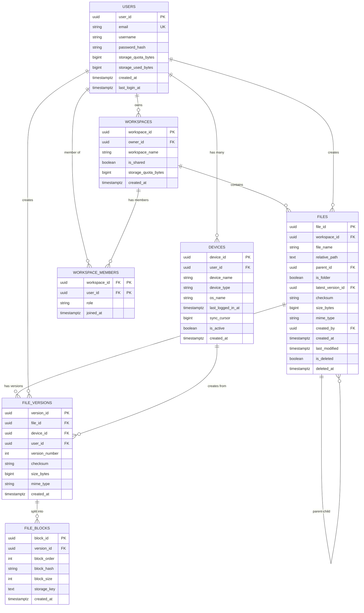

# Database Schema - Google Drive System

> **Production-complete schema** following Alex Xu's System Design (Volume 1, Chapter 15: Google Drive)

---

## 📊 Complete Entity-Relationship Diagram



---

## 🎯 Relationship Guide (Arrow Direction)

### Rule: **Arrow points FROM the table with FK → TO the referenced table**

| Relationship | FK Location | Arrow | Cardinality | Read As |
|--------------|-------------|-------|-------------|---------|
| User → Device | `devices.user_id` | Device → User | 1:N | "One user **has many** devices" |
| User → Workspace (owner) | `workspaces.owner_id` | Workspace → User | 1:N | "One user **owns many** workspaces" |
| User ↔ Workspace (members) | `workspace_members.user_id/workspace_id` | Both | N:N | "**Many-to-many** via junction table" |
| Workspace → File | `files.workspace_id` | File → Workspace | 1:N | "One workspace **contains many** files" |
| File → File (parent-child) | `files.parent_id` | Child → Parent | 1:N | "One folder **contains many** files" |
| User → File (creator) | `files.created_by` | File → User | 1:N | "One user **creates many** files" |
| File → Version | `file_versions.file_id` | Version → File | 1:N | "One file **has many** versions" |
| Device → Version | `file_versions.device_id` | Version → Device | 1:N | "One device **creates many** versions" |
| Version → Block | `file_blocks.version_id` | Block → Version | 1:N | "One version **splits into many** blocks" |

---

## 📋 Table Schemas

### 1. **users** - User Management

**Purpose:** User accounts, authentication, storage quotas

| Column | Type | Constraints | Purpose |
|--------|------|-------------|---------|
| `user_id` | UUID | PK | Unique user identifier |
| `email` | VARCHAR(255) | UNIQUE, NOT NULL | Login credential |
| `username` | VARCHAR(100) | NOT NULL | Display name |
| `password_hash` | VARCHAR(255) | NOT NULL | Bcrypt/Argon2 hash |
| `storage_quota_bytes` | BIGINT | DEFAULT 15GB | Storage limit |
| `storage_used_bytes` | BIGINT | DEFAULT 0 | Current usage |
| `created_at` | TIMESTAMP | NOT NULL | Account creation |
| `last_login_at` | TIMESTAMP | NULLABLE | Last login time |

**Indexes:** 
- `email` (unique)

**Example:**
```sql
INSERT INTO users VALUES (
    'u-123', 
    'john@example.com', 
    'John Doe', 
    '$2b$12$...', 
    15000000000,  -- 15GB
    5000000000,   -- 5GB used
    NOW(), 
    NOW()
);
```

---

### 2. **devices** - Multi-Device Sync

**Purpose:** Track sync state per device (phone, laptop, web)

| Column | Type | Constraints | Purpose |
|--------|------|-------------|---------|
| `device_id` | UUID | PK | Unique device identifier |
| `user_id` | UUID | FK → users, NOT NULL | Device owner |
| `device_name` | VARCHAR(100) | NOT NULL | User-friendly name |
| `device_type` | VARCHAR(50) | NOT NULL | 'mobile', 'desktop', 'web' |
| `os_name` | VARCHAR(50) | NULLABLE | 'iOS 17', 'macOS 14' |
| `last_logged_in_at` | TIMESTAMP | NOT NULL | Last activity |
| `sync_cursor` | BIGINT | DEFAULT 0 | Last synced version |
| `is_active` | BOOLEAN | DEFAULT TRUE | Logged out if FALSE |
| `created_at` | TIMESTAMP | NOT NULL | Device registration |

**Indexes:**
- `user_id`

**Example:**
```sql
INSERT INTO devices VALUES (
    'd-456',
    'u-123',           -- John's device
    'John's iPhone',
    'mobile',
    'iOS 17.2',
    NOW(),
    1500,              -- Synced up to version 1500
    TRUE,
    NOW()
);
```

**Use Case:**
```python
# Get changes since device's last sync
changes = await db.fetch(
    "SELECT * FROM file_versions WHERE version_id > $1",
    device.sync_cursor
)
```

---

### 3. **workspaces** - Team Collaboration

**Purpose:** Organize files into personal or shared spaces

| Column | Type | Constraints | Purpose |
|--------|------|-------------|---------|
| `workspace_id` | UUID | PK | Unique workspace ID |
| `owner_id` | UUID | FK → users, NOT NULL | Workspace creator |
| `workspace_name` | VARCHAR(255) | NOT NULL | Display name |
| `is_shared` | BOOLEAN | DEFAULT FALSE | Team vs personal |
| `storage_quota_bytes` | BIGINT | NULLABLE | Team quota (NULL = use owner's) |
| `created_at` | TIMESTAMP | NOT NULL | Creation time |

**Indexes:**
- `owner_id`

**Example:**
```sql
-- Personal workspace
INSERT INTO workspaces VALUES (
    'w-789',
    'u-123',
    'My Drive',
    FALSE,             -- Personal
    NULL,              -- Use owner's quota
    NOW()
);

-- Shared team workspace
INSERT INTO workspaces VALUES (
    'w-999',
    'u-123',
    'Marketing Team',
    TRUE,              -- Shared
    100000000000,      -- 100GB team quota
    NOW()
);
```

---

### 4. **workspace_members** - Access Control

**Purpose:** Many-to-many relationship (User ↔ Workspace)

| Column | Type | Constraints | Purpose |
|--------|------|-------------|---------|
| `workspace_id` | UUID | FK → workspaces, PK | Workspace being shared |
| `user_id` | UUID | FK → users, PK | User being granted access |
| `role` | VARCHAR(20) | NOT NULL | 'owner', 'editor', 'viewer' |
| `joined_at` | TIMESTAMP | NOT NULL | When access granted |

**Composite Primary Key:** `(workspace_id, user_id)`

**Example:**
```sql
-- Share "Marketing Team" with Sarah (editor) and Mike (viewer)
INSERT INTO workspace_members VALUES 
    ('w-999', 'u-123', 'owner', NOW()),   -- John (owner)
    ('w-999', 'u-456', 'editor', NOW()),  -- Sarah (can edit)
    ('w-999', 'u-789', 'viewer', NOW());  -- Mike (read-only)
```

**Access Check:**
```sql
-- Check if user can access file
SELECT 1 
FROM files f
JOIN workspace_members wm ON f.workspace_id = wm.workspace_id
WHERE f.file_id = 'f-123' AND wm.user_id = 'u-456';
```

---

### 5. **files** - Hierarchical File System

**Purpose:** Files and folders with workspace isolation

| Column | Type | Constraints | Purpose |
|--------|------|-------------|---------|
| `file_id` | UUID | PK | Unique file identifier |
| `workspace_id` | UUID | FK → workspaces, NOT NULL | Workspace isolation |
| `file_name` | VARCHAR(255) | NOT NULL | File or folder name |
| `relative_path` | TEXT | NOT NULL, INDEXED | Full path (denormalized) |
| `parent_id` | UUID | FK → files, NULLABLE | Parent folder (NULL = root) |
| `is_folder` | BOOLEAN | DEFAULT FALSE | TRUE for folders |
| `latest_version_id` | UUID | NULLABLE | Current version pointer |
| `checksum` | VARCHAR(64) | NULLABLE, INDEXED | SHA-256 hash |
| `size_bytes` | BIGINT | NULLABLE | File size |
| `mime_type` | VARCHAR(255) | NULLABLE | Content type |
| `created_by` | UUID | FK → users, NOT NULL | File creator |
| `created_at` | TIMESTAMP | NOT NULL | Creation time |
| `last_modified` | TIMESTAMP | NOT NULL | Last update time |
| `is_deleted` | BOOLEAN | DEFAULT FALSE | Soft delete (trash) |
| `deleted_at` | TIMESTAMP | NULLABLE | Deletion timestamp |

**Indexes:**
- `workspace_id, relative_path` (fast path lookup)
- `parent_id, is_folder` (folder listing)
- `parent_id, file_name` (name lookup)
- `workspace_id, is_deleted` (filter deleted)
- `checksum` (deduplication)

**Example Hierarchy:**
```sql
-- Root folder
INSERT INTO files VALUES (
    'f-1', 'w-789', 'My Drive', '/', NULL, TRUE, 
    NULL, NULL, 0, NULL, 'u-123', NOW(), NOW(), FALSE, NULL
);

-- Subfolder
INSERT INTO files VALUES (
    'f-2', 'w-789', 'Documents', '/Documents', 'f-1', TRUE,
    NULL, NULL, 0, NULL, 'u-123', NOW(), NOW(), FALSE, NULL
);

-- File
INSERT INTO files VALUES (
    'f-3', 'w-789', 'report.pdf', '/Documents/report.pdf', 'f-2', FALSE,
    'v-123', 'abc123...', 1048576, 'application/pdf', 
    'u-123', NOW(), NOW(), FALSE, NULL
);
```

---

### 6. **file_versions** - Version History

**Purpose:** Audit trail with device tracking

| Column | Type | Constraints | Purpose |
|--------|------|-------------|---------|
| `version_id` | UUID | PK | Unique version ID |
| `file_id` | UUID | FK → files, NOT NULL | Which file |
| `device_id` | UUID | FK → devices, NULLABLE | Which device created this |
| `user_id` | UUID | FK → users, NOT NULL | Who created this |
| `version_number` | INT | NOT NULL | Monotonic version (1, 2, 3...) |
| `checksum` | VARCHAR(64) | NOT NULL, INDEXED | Content hash |
| `size_bytes` | BIGINT | NOT NULL | File size at this version |
| `mime_type` | VARCHAR(255) | NOT NULL | MIME type |
| `created_at` | TIMESTAMP | NOT NULL | Version creation time |

**Indexes:**
- `file_id, version_number` (version lookup)
- `file_id, created_at` (chronological)
- `device_id` (device-specific queries)

**Composite Unique:** `(file_id, version_number)`

**Example:**
```sql
-- Version history for report.pdf
INSERT INTO file_versions VALUES 
    ('v-1', 'f-3', 'd-456', 'u-123', 1, 'abc123...', 1000000, 'application/pdf', '2026-01-01'),
    ('v-2', 'f-3', 'd-789', 'u-123', 2, 'def456...', 1050000, 'application/pdf', '2026-01-02'),
    ('v-3', 'f-3', 'd-456', 'u-123', 3, 'ghi789...', 1100000, 'application/pdf', '2026-01-03');
```

**Conflict Detection:**
```sql
-- Detect concurrent edits from different devices
SELECT device_id, COUNT(*) 
FROM file_versions 
WHERE file_id = 'f-3' 
  AND created_at BETWEEN NOW() - INTERVAL '1 minute' AND NOW()
GROUP BY device_id
HAVING COUNT(*) > 1;
```

---

### 7. **file_blocks** - Differential Sync

**Purpose:** Block-level storage for large files

| Column | Type | Constraints | Purpose |
|--------|------|-------------|---------|
| `block_id` | UUID | PK | Unique block ID |
| `version_id` | UUID | FK → file_versions, NOT NULL | Which version |
| `block_order` | INT | NOT NULL | Position (0, 1, 2...) |
| `block_hash` | VARCHAR(64) | NOT NULL, INDEXED | SHA-256 of block |
| `block_size` | INT | DEFAULT 4096 | Block size (4KB) |
| `storage_key` | TEXT | NOT NULL | MinIO/S3 key |
| `created_at` | TIMESTAMP | NOT NULL | Block creation |

**Indexes:**
- `version_id, block_order` (ordered retrieval)
- `block_hash` (deduplication)

**Composite Unique:** `(version_id, block_order)`

**Example:**
```sql
-- 100MB file = 25,600 blocks
INSERT INTO file_blocks VALUES 
    ('b-1', 'v-3', 0, 'abc123...', 4096, 'v1/blocks/ab/c1/abc123...', NOW()),
    ('b-2', 'v-3', 1, 'def456...', 4096, 'v1/blocks/de/f4/def456...', NOW()),
    ('b-3', 'v-3', 2, 'ghi789...', 4096, 'v1/blocks/gh/i7/ghi789...', NOW()),
    -- ... 25,597 more blocks
    ('b-25600', 'v-3', 25599, 'xyz999...', 4096, 'v1/blocks/xy/z9/xyz999...', NOW());
```

**File Reassembly:**
```python
# Download and reassemble file
blocks = await db.fetch(
    """
    SELECT block_order, block_hash, storage_key 
    FROM file_blocks 
    WHERE version_id = $1 
    ORDER BY block_order
    """,
    version_id
)

with open('output.pdf', 'wb') as f:
    for block in blocks:
        data = await minio.download(block['storage_key'])
        f.write(data)
```

---

## 🔍 Key Design Decisions

### ✅ **1. Why UUID instead of Auto-Increment?**

```
❌ Auto-Increment:
  - Single point of contention (database generates IDs)
  - Doesn't work across shards
  - Exposes business metrics (ID=1000000 → 1M users)

✅ UUID:
  - Generated client-side (no database round-trip)
  - Works across multiple shards
  - Globally unique
  - 36 characters vs 4-8 bytes (trade-off accepted)
```

### ✅ **2. Why Denormalize `relative_path`?**

```
❌ Without relative_path:
  SELECT name FROM files WHERE file_id = 'f-3'
  -- Result: "report.pdf"
  -- Need recursive query to get "/Documents/report.pdf"

✅ With relative_path:
  SELECT relative_path FROM files WHERE file_id = 'f-3'
  -- Result: "/Documents/report.pdf" (instant!)
```

### ✅ **3. Why `workspace_id` instead of just `user_id`?**

```
Single user_id:
  ❌ Can't share folders with teams
  ❌ Can't have role-based access
  ❌ Can't enforce team quotas

Workspaces:
  ✅ Personal workspace = "My Drive"
  ✅ Shared workspaces = Team collaboration
  ✅ workspace_members table = Fine-grained ACL
  ✅ Separate quotas per workspace
```

### ✅ **4. Why `device_id` in `file_versions`?**

```
Without device_id:
  ❌ Can't detect which device made changes
  ❌ Hard to debug sync conflicts
  ❌ Can't show "Edited from iPhone"

With device_id:
  ✅ Know exact sync state per device
  ✅ Detect concurrent edits (device A vs device B)
  ✅ Incremental sync (only send changes since device's cursor)
  ✅ Better UX ("Updated from John's MacBook")
```

### ✅ **5. Why `file_blocks` table?**

```
Whole file upload (100MB):
  - Upload: 100MB every time
  - Time: ~80 seconds @ 10Mbps
  - Bandwidth: Expensive

Block-level diff (4KB blocks):
  - Changed blocks: ~1% = 1MB
  - Upload: 1MB
  - Time: ~800ms
  - Bandwidth: 99% savings! 🚀
```

---

## 📊 Storage Key Patterns

### **Content-Addressed Storage (Files)**

```
Format: v1/contents/{hash[0:2]}/{hash[2:4]}/{full_hash}

Example:
  checksum = "a3f7c2e9bd4f1a8c..."
  storage_key = "v1/contents/a3/f7/a3f7c2e9bd4f1a8c..."

Benefits:
  ✅ Deduplication (same hash = same file)
  ✅ Distributed prefixes (65,536 buckets)
  ✅ Avoid S3 hot partitions
  ✅ Fast lookups
```

### **Block-Addressed Storage (Blocks)**

```
Format: v1/blocks/{hash[0:2]}/{hash[2:4]}/{full_hash}

Example:
  block_hash = "def456abc789..."
  storage_key = "v1/blocks/de/f4/def456abc789..."

Benefits:
  ✅ Block deduplication across versions
  ✅ Block reuse across files
  ✅ Same distribution as content storage
```

---

## 🎯 Interview-Ready Concepts

### **Question 1: How do you handle file sharing?**

**Answer:**
```
1. Workspaces provide isolation
2. workspace_members junction table for N:N relationship
3. Role-based access: owner, editor, viewer
4. Query pattern:
   - JOIN files → workspace_members
   - Filter by user_id
   - Check role for permissions
```

### **Question 2: How does multi-device sync work?**

**Answer:**
```
1. Each device has sync_cursor (last seen version)
2. Client polls: "Give me changes since cursor=1500"
3. Server returns: file_versions WHERE version_id > 1500
4. Client applies changes, updates cursor=1550
5. Next poll requests changes since 1550
```

### **Question 3: How do you detect sync conflicts?**

**Answer:**
```
1. Device A edits file offline (cursor=1500)
2. Device B edits same file offline (cursor=1500)
3. Both come online and push changes
4. Server detects:
   - Two versions created from same base (1500)
   - Different device_ids
5. Resolution:
   - Last-write-wins: Keep newer version
   - Manual merge: Create conflict copy
   - Operational Transform: Merge both (text files only)
```

### **Question 4: When do you use block-level storage?**

**Answer:**
```
Use blocks when:
  ✅ File size > 50MB
  ✅ Frequent incremental edits (logs, videos)
  ✅ Multiple versions expected

Don't use blocks when:
  ❌ File size < 10MB (overhead > savings)
  ❌ Rare updates (upload once, never change)
  ❌ Highly compressed (JPEG, MP4 - already optimized)
```

---

## 📐 ERD Arrow Cheat Sheet

```
User ||--o{ Device
     ↑      ↓
  One user has many devices
  (FK: device.user_id → user.user_id)

User }o--o{ Workspace
     ↑           ↑
  Many-to-many via workspace_members
  (Two FKs: workspace_members.user_id + workspace_id)

File ||--o{ File
     ↑      ↓
  Self-referencing (parent-child)
  (FK: file.parent_id → file.file_id)
```

**Reading:**
- `||` = Exactly one (required)
- `}o` = Zero or many
- `--` = Relationship line
- Arrow points FROM FK → TO referenced table

---

## 🚀 Next Steps

1. **Initialize database:** `python init_db.py`
2. **Verify tables:** Check PostgreSQL for all 7 tables
3. **Create test data:** Insert users, devices, workspaces
4. **Test relationships:** Verify foreign keys work correctly
5. **Add indexes:** Monitor query performance and add missing indexes

**Resources:**
- [ARCHITECTURE.md](ARCHITECTURE.md) - Overall system design
- [SHARDING.md](SHARDING.md) - Data partitioning strategy
- [BLOCK_SYNC.md](BLOCK_SYNC.md) - Differential synchronization
