# 🎥 Distributed Video Transcoding Engine

## 🏗 System Architecture
- **API:** FastAPI (Submits Workflows)
- **Orchestrator:** Temporal (Durable Execution)
- **Workers:** Python + FFmpeg (Stateless Compute)
- **Storage:** Minio (S3-Compatible)

## 📊 Milestone Tracker

| Phase | Goal | Status | Key Learning |
| :--- | :--- | :--- | :--- |
| **M0** | Infra Scaffolding | ✅ Done | Docker-compose for Distributed systems |
| **M1** | Hello Transcode | ✅ Done | Temporal Workflows & Activity patterns |
| **M2** | Parallel DAG | ✅ Done | Chunk-based parallel transcoding |
| **M3** | Failure Injection| 🔘 Todo | Idempotency & Retries (Staff Skill) |

## 🛠 Design Decisions
- **Why Temporal?** To avoid writing complex state-machine logic for retries.
- **Why S3/Minio?** Decoupling storage from compute; allows workers to scale.
- **Why Chunk-based?** Parallelism + failure isolation (retry only failed chunks).

---

## 📂 Storage Structure

Single bucket (`videos`) with prefixes:
```
videos/
  {video_id}/
    source/source.mp4           # Original uploaded video
    chunks/source/              # GOP-aligned source chunks
      chunk_0000.mp4
      chunk_0001.mp4
      ...
    manifests/
      source.json               # Chunk manifest (ordering)
    outputs/
      720p/segments/            # Transcoded chunks per resolution
        seg_0000.mp4
        seg_0001.mp4
      480p/segments/
        ...

encoded/                        # Final merged outputs
  {video_id}_720p.mp4
  {video_id}_480p.mp4
```

---

## 🔄 Workflow Pipeline

```mermaid
flowchart TD
    subgraph Input
        A[📤 Upload Video] --> B[source.mp4]
    end

    subgraph Orchestration["Temporal Workflow"]
        B --> C{YouTube URL?}
        C -->|Yes| D[🌐 Download Activity]
        C -->|No| E[📊 Metadata Activity]
        D --> E
        E --> F[✂️ Split Activity]
        
        F --> G[chunk_0]
        F --> H[chunk_1]
        F --> I[chunk_N]
        
        subgraph Parallel["Parallel Transcode (chunks × resolutions)"]
            G --> G720[720p] & G480[480p] & G320[320p]
            H --> H720[720p] & H480[480p] & H320[320p]
            I --> I720[720p] & I480[480p] & I320[320p]
        end
        
        G720 & H720 & I720 --> M720[🔗 Merge 720p]
        G480 & H480 & I480 --> M480[🔗 Merge 480p]
        G320 & H320 & I320 --> M320[🔗 Merge 320p]
        
        M720 --> O[📦 Final Videos]
        M480 --> O
        M320 --> O
        
        O --> CL[🗑️ Cleanup Chunks]
    end

    subgraph Output
        CL --> Z[✅ Complete]
    end
```



---

## 🔄 Activity Flow Diagram

```mermaid
sequenceDiagram
    participant API as FastAPI
    participant T as Temporal
    participant DW as Download Worker
    participant MW as Metadata Worker
    participant SW as Split Worker
    participant TW as Transcode Workers (x4)
    participant MGW as Merge Worker
    participant S3 as MinIO

    API->>T: Start VideoWorkflow(video_id, url)
    
    T->>DW: download_youtube_video
    DW->>S3: Upload source.mp4
    DW-->>T: ✓ Downloaded
    
    T->>MW: extract_metadata
    MW->>S3: Read source.mp4
    MW-->>T: ✓ {width, height, duration}
    
    T->>SW: split_video
    SW->>S3: Download source.mp4
    SW->>S3: Upload chunks + manifest
    SW-->>T: ✓ {chunk_count, chunks[]}
    
    par Parallel Transcode (chunks × resolutions)
        T->>TW: transcode_chunk(0, 720p)
        T->>TW: transcode_chunk(0, 480p)
        T->>TW: transcode_chunk(1, 720p)
        T->>TW: transcode_chunk(1, 480p)
        Note over TW: ... N chunks × M resolutions
        TW->>S3: Upload seg_XXXX.mp4
        TW-->>T: ✓ chunk complete
    end
    
    par Merge per Resolution
        T->>MGW: merge_segments(720p)
        T->>MGW: merge_segments(480p)
        MGW->>S3: Download segments (ordered)
        MGW->>S3: Upload final video
        MGW-->>T: ✓ merged
    end
    
    T->>SW: cleanup_source_chunks
    SW->>S3: Delete chunks
    
    T-->>API: ✅ Workflow Complete
```



---

## 🐳 Docker Services

| Service | Queue | Replicas | Purpose |
|---------|-------|----------|---------|
| `api` | - | 1 | FastAPI server |
| `workflow-worker` | video-tasks | 1 | Workflow orchestration |
| `download-worker` | download-queue | 2 | YouTube downloads |
| `metadata-worker` | metadata-queue | 1 | FFprobe metadata |
| `split-worker` | split-queue | 1 | Video chunking |
| `chunk-transcode-worker` | transcode-queue | 4 | Parallel chunk transcoding |
| `merge-worker` | merge-queue | 2 | Segment assembly |

---

## 🚀 Quick Start

```bash
cd docker
docker-compose up -d

# Access:
# - API: http://localhost:8000
# - Temporal UI: http://localhost:8080
# - MinIO Console: http://localhost:9001 (admin/password123)
```

---

## 💡 Why Chunks/GOPs?

1. **Parallelism**: Split a 2-hour video into 1800 chunks (4s each); workers process in parallel.
2. **Failure Isolation**: Worker crash loses only one chunk; others continue.
3. **Faster Recovery**: Requeue only the failed chunk; no wasted work.
4. **Streaming-Ready**: Output is already chunked for HLS/DASH.

---

## 🏗️ System Design Evaluation (Load & Concurrency)

This architecture uses the **Competing Consumers Pattern** to decouple traffic spikes from processing capacity.

### 1. Robustness Under Load (The "Flood" Scenario)
If 1,000 users upload videos simultaneously:
*   **System State**: The API accepts all requests instantly (async) and creates 1,000 Workflow Executions in Temporal.
*   **Input Queue**: 1,000 tasks pile up in the `download-queue` or `split-queue`.
*   **Processing**: The Workers (`split-worker`, `transcode-worker`) pull tasks at their maximum capable rate (e.g., 4 concurrent tasks if there are 4 workers).
*   **Outcome**: The system **does not crash**. It simply processes the backlog at a constant rate. Throughput remains stable; latency per job increases linearly with queue depth.

### 2. Concurrency Control
*   **Temporal Queues**: Act as infinite buffers.
*   **Worker Polling**: Workers only request a new task when they finish the current one. This implements automatic **Backpressure**.
*   **Isolation**: A crash in one transcoding worker retries only that specific chunk (small unit of work), not the whole video.

### 3. Bottlenecks & Scaling
*   **CPU**: Transcoding is CPU-bound. Scale `chunk-transcode-worker` replicas to increase throughput.
*   **Network/IO**: Verify MinIO/S3 bandwidth when hundreds of workers download chunks simultaneously.
*   **Database**: Temporal's DB handles the state transitions. For extreme scale (>10k workflows/sec), this needs tuning.

---

## ☁️ AWS Deployment Guide

To move this system from Docker Compose to a production-grade AWS solution:

### 1. Orchestration (Temporal)
*   **Option A (Managed):** Use **Temporal Cloud**. Simplest, zero maintenance. Point workers to the cloud namespace.
*   **Option B (Self-Hosted):** deploy Temporal Cluster on **Amazon EKS** (Kubernetes) or a fleet of EC2 instances. Requires:
    *   **RDS (PostgreSQL/MySQL)** or **Cassandra** for persistence.
    *   **Amazon OpenSearch** for visibility (advanced search).

### 2. Compute (Workers)
*   **Service**: **Amazon ECS (Fargate)** or **EKS**.
*   **Strategy**: Deploy workers as containers.
    *   `split-worker`: High Memory instances (RAM for buffering large files).
    *   `transcode-worker`: **Compute Optimized (c6g/c7g)** instances. Spot Instances save 90% cost here since tasks are idempotent and retriable.
    *   `merge-worker`: General purpose or Memory optimized (merging involves IO).
*   **Auto-Scaling**: Configure **KEDA** (Kubernetes) or AWS Auto Scaling to scale worker count based on Temporal Queue Depth.

### 3. Storage
*   **Service**: **Amazon S3**.
*   **Migration**: Replace MinIO connection details with AWS IAM Roles (IRSA) and S3 bucket endpoints.
*   **Lifecycle**: Use S3 Lifecycle Policies to auto-delete `chunks/` after 24 hours to save costs.

### 4. API Layer
*   **Service**: **AWS App Runner** or **ECS Fargate** behind an **Application Load Balancer (ALB)**.
*   **Security**: WAF for protection, Cognito for user auth.

### 5. Deployment Diagram
```mermaid
graph TD
    User -->|State/Status| API[AWS App Runner (FastAPI)]
    User -->|Video Upload| S3[Amazon S3 Bucket]
    
    API -->|Start Workflow| T[Temporal Cloud]
    
    subgraph "Auto-Scaling Worker Fleet (ECS/EKS)"
        W1[Split Workers] 
        W2[Transcode Workers (Spot Instances)]
        W3[Merge Workers]
    end
    
    T -->|Dispatch Tasks| W1 & W2 & W3
    W1 & W2 & W3 -->|Read/Write| S3
```