# 🎥 Distributed Video Transcoding Engine

## 🏗 System Architecture
- **API:** FastAPI (Submits Workflows)
- **Orchestrator:** Temporal (Durable Execution)
- **Workers:** Python + FFmpeg (Stateless Compute)
- **Storage:** Minio (S3-Compatible)

## 📊 Milestone Tracker

| Phase | Goal | Status | Key Learning |
| :--- | :--- | :--- | :--- |
| **M0** | Infra Scaffolding | ✅ Done | Docker-compose for Distributed systems |
| **M1** | Hello Transcode | ✅ Done | Temporal Workflows & Activity patterns |
| **M2** | Parallel DAG | ✅ Done | Chunk-based parallel transcoding |
| **M3** | Failure Injection| 🔘 Todo | Idempotency & Retries (Staff Skill) |

## 🛠 Design Decisions
- **Why Temporal?** To avoid writing complex state-machine logic for retries.
- **Why S3/Minio?** Decoupling storage from compute; allows workers to scale.
- **Why Chunk-based?** Parallelism + failure isolation (retry only failed chunks).

---

## 📂 Storage Structure

Single bucket (`videos`) with prefixes:
```
videos/
  {video_id}/
    source/source.mp4           # Original uploaded video
    chunks/source/              # GOP-aligned source chunks
      chunk_0000.mp4
      chunk_0001.mp4
      ...
    manifests/
      source.json               # Chunk manifest (ordering)
    outputs/
      720p/segments/            # Transcoded chunks per resolution
        seg_0000.mp4
        seg_0001.mp4
      480p/segments/
        ...

encoded/                        # Final merged outputs
  {video_id}_720p.mp4
  {video_id}_480p.mp4
```

---

## 🔄 Workflow Pipeline

```mermaid
flowchart TD
    subgraph Input
        A[📤 Upload Video] --> B[source.mp4]
    end

    subgraph Orchestration["Temporal Workflow"]
        B --> C{YouTube URL?}
        C -->|Yes| D[🌐 Download Activity]
        C -->|No| E[📊 Metadata Activity]
        D --> E
        E --> F[✂️ Split Activity]
        
        F --> G[chunk_0]
        F --> H[chunk_1]
        F --> I[chunk_N]
        
        subgraph Parallel["Parallel Transcode (chunks × resolutions)"]
            G --> G720[720p] & G480[480p] & G320[320p]
            H --> H720[720p] & H480[480p] & H320[320p]
            I --> I720[720p] & I480[480p] & I320[320p]
        end
        
        G720 & H720 & I720 --> M720[🔗 Merge 720p]
        G480 & H480 & I480 --> M480[🔗 Merge 480p]
        G320 & H320 & I320 --> M320[🔗 Merge 320p]
        
        M720 --> O[📦 Final Videos]
        M480 --> O
        M320 --> O
        
        O --> CL[🗑️ Cleanup Chunks]
    end

    subgraph Output
        CL --> Z[✅ Complete]
    end
```



---

## 🔄 Activity Flow Diagram


---

## 🐳 Docker Services

| Service | Queue | Replicas | Purpose |
|---------|-------|----------|---------|
| `api` | - | 1 | FastAPI server |
| `workflow-worker` | video-tasks | 1 | Workflow orchestration |
| `download-worker` | download-queue | 2 | YouTube downloads |
| `metadata-worker` | metadata-queue | 1 | FFprobe metadata |
| `split-worker` | split-queue | 1 | Video chunking |
| `chunk-transcode-worker` | transcode-queue | 4 | Parallel chunk transcoding |
| `merge-worker` | merge-queue | 2 | Segment assembly |

---

## 🚀 Quick Start

```bash
cd docker
docker-compose up -d

# Access:
# - API: http://localhost:8000
# - Temporal UI: http://localhost:8080
# - MinIO Console: http://localhost:9001 (admin/password123)
```

---

## 💡 Why Chunks/GOPs?

1. **Parallelism**: Split a 2-hour video into 1800 chunks (4s each); workers process in parallel.
2. **Failure Isolation**: Worker crash loses only one chunk; others continue.
3. **Faster Recovery**: Requeue only the failed chunk; no wasted work.
4. **Streaming-Ready**: Output is already chunked for HLS/DASH.